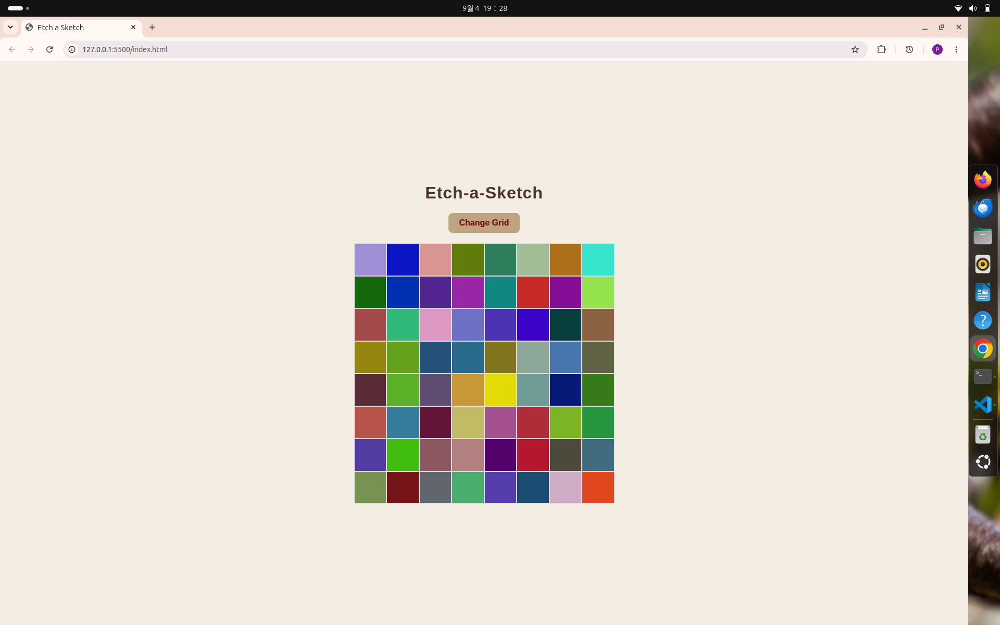

# etch-a-sketch

A little drawing grid you can sketch on with your mouse, built while going through [The Odin Project](https://www.theodinproject.com/).

## What it does

- Move your mouse over the grid and it starts drawing — each square gets a bit darker every time you hover over it
- Click the button to pick a new grid size, anywhere from 1 to 100 squares per side
- The layout is responsive, so it resizes to fit smaller screens

## How I built it

The grid is just a bunch of divs created in JavaScript and dropped into a flex container that wraps them into rows. Square size is calculated from the container's actual width, so everything scales properly no matter the screen size.

Each square starts out as a random color, and every time you hover over it, the color gets multiplied down a bit — so it slowly fades to black instead of just being one flat color.

## What I learned

- Creating and appending elements to the DOM with JavaScript
- Building a grid layout with flex-box instead of CSS Grid
- A tricky bug where borders were throwing off my square sizes because of `box-sizing`
- Making sizes responsive by reading the actual rendered width instead of hardcoding pixels

## Live demo

[ETCH-A-Sketch] (https://pramod2026-ops.github.io/etch-a-sketch/)

## Screenshot

